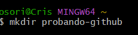
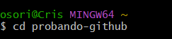
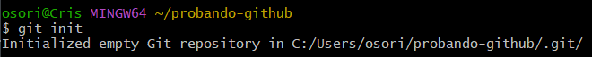
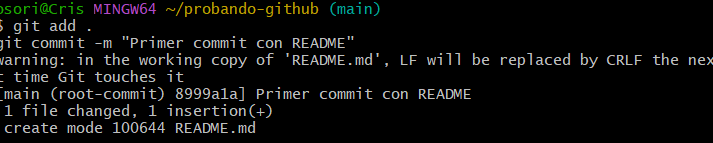
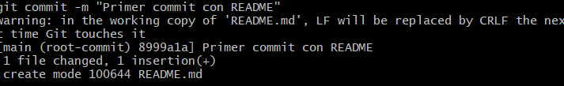
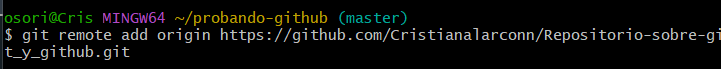
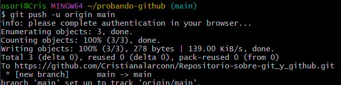
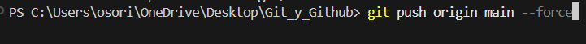

<div align="center">

# Informe Git y GitHub   
### Cristian Alarcon  
### 2025  

---


</div>

---

## Descripcion general  

Informe sobre **Git** y **GitHub**, dos herramientas esenciales para el control de versiones y la colaboracion en proyectos de desarrollo con ayuda de videos y documentos  
Contiene conceptos basicos, comandos principales y un ejemplo practico del proceso de trabajo con Git y GitHub

---

## Estructura del repositorio  
- `README.md`  Documento principal con el informe  
- Carpeta `imagenes/`  Contiene capturas usadas en el informe  

---

# Que es Git y GitHub

## Que es Git

**Git** es un **sistema de control de versiones** creado por *Linus Torvalds* en 2005  
Su funcion principal es **registrar los cambios** que se realizan en los archivos de un proyecto como codigo o configuraciones permitiendo

- Guardar versiones anteriores del proyecto  
- Trabajar en equipo sin sobrescribir el trabajo de otros  
- Volver atras en caso de errores  
- Llevar un control ordenado del progreso del desarrollo

En resumen  
> Git es una herramienta que **guarda el historial de un proyecto** y permite **trabajar de forma colaborativa y segura**

---

## Que es GitHub

**GitHub** es una **plataforma en la nube** que usa Git para almacenar y compartir proyectos  
Permite **subir repositorios** con codigo o documentos y trabajar con otras personas desde cualquier lugar

### Con GitHub puedo
- Guardar proyectos en linea  
- Colaborar con compañeros o equipos  
- Revisar cambios, hacer sugerencias y resolver conflictos  
- Mostrar proyectos al publico o mantenerlos privados  

En resumen  
> GitHub es el **lugar donde los proyectos Git pueden estar** y donde puedo **compartirlos, colaborar y aprender de otros desarrolladores**

---

## Ejemplo simple

1. Creo un proyecto en mi PC y lo controlo con **Git**  
2. Conecto ese proyecto a **GitHub**  
3. Subo los cambios con `git push` y los veo en la web, en mi repositorio  
4. Si alguien mas hace cambios, puedo traerlos con `git pull`


*Git y GitHub nos permiten desarrollar proyectos de forma profesional segura y tambien colaborativa*

## 1. Principales comandos de Git

| Comando | Descripcion |
|----------|--------------|
| `git init` | Inicializa un nuevo repositorio Git en una carpeta local es decir crea un .git |
| `git status` | Muestra los archivos modificados nuevos o eliminados  |
| `git add .` | Agrega todos los cambios al area de preparación por que tiene el(.), se puede seleccionar por aparte cada archivos |
| `git commit -m "cambio"` | Guarda los cambios con un mensaje que describe sobre lo que modificamos o subimos |
| `git log` | Muestra el historial de commits realizados |
| `git remote add origin URL` | Conecta nuestra carpeta local con un repositorio en GitHub |
| `git push` | Envía los cambios locales al repositorio remoto (GitHub) |
| `git pull` | Descarga los cambios más recientes desde GitHub hacia nuestra carpeta|
| `git clone URL` | Crea una copia local de un repositorio existente de git hub |

---

## Proceso paso a paso para enviar los cambios a GitHub

1. **Crear una carpeta local**  
   ```bash
   mkdir mi-proyecto
   cd mi-proyecto
   ```
      
      
      
  <p align="center">
  
    </p>

  <p align="center">
  
    </p>


2. **Inicializar Git**
 ```bash
    git init
```

   <p align="center">
  
    </p>


3. **Agregar archivos al área de seguimiento**
 ```bash
git add .
```

   <p align="center">
  
    </p>

4. **Guardar cambios con un commit**
 ```bash
git commit -m "commit"
```
   <p align="center">
  
    </p>

5. **Conectar con tu repositorio remoto en GitHub**
 ```bash
git remote add origin
```
<p align="center">
  
    </p>

6. **Subir los cambios al repositorio remoto**
 ```bash
git push -u origin main
```
<p align="center">
  
    </p>

7. **Subir los cambios al repositorio remoto forzadamente-no es la mejor opcion**
 ```bash
git push -u origin main
```
<p align="center">
  
    </p>

8. **Verificar en GitHub**  
Abrir el repositorio en GitHub y revisar que los archivos esten ahi  

*El proceso anterior fue desarrollado por medio de Git Bash, pero tambien puede ejecutarse desde la terminal de Visual Studio Code, a excepcion de algunos comandos*  

---

## Conclusion  
Git y GitHub son herramientas necesarias para cualquier desarrollador moderno  
Mientras Git nos permite gestionar el historial y las versiones del codigo de forma local  
GitHub nos permite la colaboracion y el trabajo en equipo desde la nube  

> Dominar estas herramientas nos facilita el desarrollo profesional y la organizacion de cualquier proyecto de software
en nuestro caso ADSO


##  Documentación oficial consultada

- [Documentación oficial de Git](https://git-scm.com/doc) — Sitio de referencia principal para Git, con manuales, guías de usuario y páginas de comandos 
- [Documentación oficial de GitHub](https://docs.github.com/) — Guía de uso de GitHub para repositorios, colaboración, conexión con Git, SSH.  

##  Videos vistos

- [Video dado para el trabajo](https://youtu.be/VdGzPZ31ts8?si=k_ZFwrKDfu9koKIj) — Video Curso gratis  
- [Video dado para el Trabajo](https://youtu.be/jGehuhFhtnE?si=kYlNQYcC8qua7ZN4) — Video con informacion sobre que es git y como funciona 


